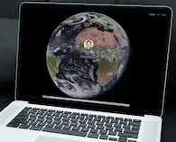

# macOS live wallpaper - satellite image of Europe/Africa

This is a tiny macOS launch daemon that updates the wallpaper to a near live* image of the weather satellite [Meteosat 0°](https://eumetview.eumetsat.int/static-images/latestImages.html) (showing Europe/Africa).

(* update frequency is about every 1 to 2 hours)




## installation

```
# clone repo
git clone https://github.com/christian-korneck/livewallpaper_meteosat.git
cd livewallpaper_meteosat

# create folder for script + temp images
mkdir -p "$HOME/Library/Application Support/my.wallpaper"

# copy script
cp wallpaper.sh "$HOME/Library/Application Support/my.wallpaper/"
chmod +rx "$HOME/Library/Application Support/my.wallpaper/wallpaper.sh"

# create launch daemon
cp my.wallpaper.cronjob.plist "$HOME/Library/LaunchAgents/"
cd "$HOME/Library/LaunchAgents"
sed "s|\$HOME|$HOME|g" my.wallpaper.cronjob.plist > my.wallpaper.cronjob.plist
launchctl load my.wallpaper.cronjob.plist
launchctl start my.wallpaper.cronjob
```

In case that the wallpaper doesn't appear or is in the wrong scaling/aspect ratio you may need to go once to `System Preferences` -> `Desktop & Screen Saver` to select and adjust the correct wallpaper.


